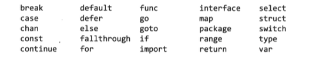
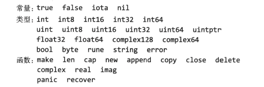

# 程序结构

## 名称
Go 中函数、变量、常量、类型、语句标签和包的名称遵循一个简单的规则：名称的开头是一个字母或下划线，后面跟任意数量的字符、数字和下划线，并区分大小写。风格上，当遇到由单词组合的名称时，一般使用“驼峰式”的风格。

Go 有25个关键字，只能用在语法允许的地方，它们不能作为名称：


另外，还有三十几个内置的预声明的常量、类型和函数：


如果一个实体在函数中声明，它只在函数局部有效。如果声明在函数外，它将对包里面的所有源文件可见。实体第一个字母的大小写决定其可见性是否可以跨包。如果名称以大写字母开头，它是导出的，意味着它对包外是可见和可访问的，可以被自己包之外的其它程序所引用。包名本身总是由小写字母组成。


## 声明
声明给一个程序实体命名，并且设定其部分或全部属性。有4个主要的声明：变量（var）、常量（const）、类型（type）和函数（func）。

## 变量
var 声明创建一个具体类型的变量，然后给它附加一个名字，设置它的初始值。每一个声明有一个通用的形式：

```go
var name type = expression
```

类型和表达式部分可以省略一个，但是不能都省略。如果类型省略，它的类型将由初始化表达式决定；如果表达式省略，其初始值对应于类型的零值——对于数字是0，对于布尔值是false，对于字符串是""，对于接口和引用类型（slice、指针、map、通道、函数）是nil。对于像数组或结构体这样的复合类型，零值是其所有元素或成员的零值。

### 短变量声明
在函数中，一种称作短变量声明的可选形式可以用来声明和初始化局部变量。它使用 `name := expression` 的形式，name 的类型由 expression 决定。

### 指针
变量是存储值的地方，而指针的值是一个变量的地址。

```go
x := 1
p := &x           // p 是整型指针，指向 x
fmt.Println(*p)   // "1"
*p = 2            // 等于 x = 2
fmt.Println(x)    // 结果 “2”
```

### new 函数
表达式 `new(T)` 创建一个未命名的T类型变量，初始化为T类型的零值，并返回其地址（地址类型为 *T）。

### 变量的生命周期
生命周期指在程序执行过程中变量存在的时间段。包级别变量的生命周期是整个程序的执行时间。
相反，局部变量有一个动态的声明周期：每次执行声明语句时创建一个新的实体，变量一直生存到它变得不可访问，这是它占用的存储空间被回收。
函数的参数和返回值也是局部变量，它们在其闭包函数被调用的时候创建。

### 多重赋值

计算两个整数的最大公约数：
```go
func gcd(x, y int) int {
    for (y != 0) {
        x, y = y, x%y
    }
    return x
}
```

计算斐波那契数列的第 n 个数：
```go
func fib(n int) int {
    x, y := 0, 1
    for i := 0; i < n {
        x, y = y, x+y
    }
    return x
}
```

### 类型声明
type 声明定义一个新的命名类型，它和某个已有类型使用同样的底层类型。命名类型提供了一种方式来区分底层类型的不同
或者不兼容使用，这样它们就不会在无意中混用。

> type name underlying-type

## 包和文件
在 Go 语言中包的作用和其它语言中的库或模块作用类似，用于支持模块化、封装、编译隔离和重用。
每一个包给它的声明提供独立的命名空间。

### 包初始化
包的初始化按照在程序中导入的顺序来进行，依赖顺序优先，每次初始化一个包。
包的初始化从初始化包级别的变量开始，这些变量按照声明顺序初始化，在依赖已解析完毕的情况下，根据依赖的顺序进行。

```go
var a = b + c  // 最后把 a 初始化为 3
var b = f()    // 通过调用 f 接着把 b 初始化为 2
var c = 1      // 首先初始化为 1

func f() int { return c + 1 }
```

如果包由多个 .go 文件组成，初始化按照编译器收到文件的顺序进行：go 工具会在调用编译器前将 .go 文件排序。


对于包级别的每一个变量，生命周期从其值被初始化开始，但是对于其他一些变量，比如数据表，初始化表达式不是简单地设置它的初始化值。这种情况下，init 函数的机制会比较简单。任何文件可以包含任意数量的声明如下的函数：

```go
func init() { /* ... */ }
```

这个 init 函数不能被调用和被引用，另一方面，它也是普通的函数。在每一个文件里，当程序启动的时候，init 函数按照它们声明的顺序自动执行。

## 作用域
声明将名字和程序实体关联起来，声明的作用域是指用到声明时所声明的名字的源代码段。

> **作用域和声明周期的区别**：声明的作用域是声明在程序文本中出现的区域，它是一个编译时属性。变量的生命周期是变量在程序执行期间能被程序的其他部分所引用的起止时间，它是一个运行时属性。

**语法块**是由大括号围起来的一个语句序列，比如一个循环体或函数体。在语法块内部声明的变量对块外部不可见。

**词法块**包括语法块和其他没有显式包含在打括号中的声明代码。包含了全部源代码的词法块，叫做**全局块**。

一个声明的词法块决定声明的作用域大小。当编译器遇到一个名字的引用时，将从最内层的封闭词法块到全局语法块寻找其声明。如果没有找到，它会报“undeclared name”错误；如果在内层和外层块都存在这个声明，内层的将先被找到。这种情况下，内层声明将覆盖外部声明，使它不可访问：

```go
func f() {}
var g = "g"

func main() {
    f := "f"
    fmt.Println(f)  // "f"；局部变量 f 覆盖了包级函数 f
    fmt.Println(g)  // “g”；包级变量
    fmt.Println(h)  // 编译错误：未定义h
}
```

在包级别，声明的顺序和它们的作用域没有关系，所以一个声明可以引用它自己或者跟在它后面的其他声明，使我们可以声明递归或相互递归的类型和函数。如果常量或变量声明引用它自己，则编译器会报错。
