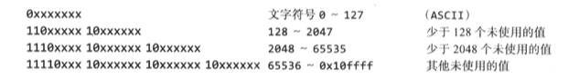
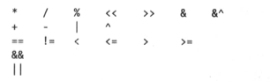

# 基本数据类型

## 整数

| 类型         | 有无符号    | 占用存储空间  | 表数范围                | 备注          |
| :---------- | :--------- | :---------- | :--------------------- | :----------  |
| int8        | 有          | 1字节       | -128 ~ 127             | |
| int16       | 有          | 2字节       | -$2^{15}$ ~ $2^{15}$-1 | |
| int32       | 有          | 4字节       | -$2^{31}$ ~ $2^{31}$-1 | |
| int64       | 有          | 8字节       | -$2^{63}$ ~ $2^{63}$-1 | |
| uint8       | 无          | 1字节       | 0 ~ 255                | |
| uint16      | 无          | 2字节       | 0 ~ $2^{16}$-1         | |
| uint32      | 无          | 4字节       | 0 ~ $2^{32}$-1         | |
| uint64      | 无          | 8字节       | 0 ~ $2^{64}$-1         | |
| int         | 有          | 4或8字节    |                        | |
| uint        | 无          | 4或8字节    |                        | |
| rune        | 有          | 与int32等价 | -$2^{31}$ ~ $2^{31}$-1 | 表示一个 Unicode 码 |
| byte        | 无          | 与uint8等价 | 0 ~ 255                | 存储字符 |


## 浮点数

浮点数的存储分为三部分，符号位+指数位+尾数位。
在存储过程中，尾数部分可能丢失，造成精度损失。


| 类型         | 占用存储空间  | 表数范围                | 备注          |
| :---------- | :---------- | :--------------------- | :----------  |
| float32     | 4字节        | -3.403E38 ~ 3.403E38   | |
| float64     | 8字节        | -1.798E308 ~ 1.798E308 | |

浮点数使用细节：
1. Go 的浮点类型有固定的范围和字段长度，不受具体操作系统的影响
2. Go 的浮点类型默认声明为 float64 类型
3. 浮点型常量有两种表示形式：十进制和科学计数法

`math.IsNaN` 函数判断其参数是否是非数值，`math.NaN` 函数怎返回非数值（NaN）。在数字运算中，我们倾向于将 NaN 当作信号值，但直接判断具体的计算结果是否为 NaN 可能导致潜在错误，因为与 NaN 的比较总不成立：

```go
nan := math.NaN()
fmt.Println(nan == nan, nan < nan, nan > nan) // “false false false”
```


## 复数类型
Go 具备两种大小的复数 complex64 和 complex128，二者分别由 float32 和float64 构成。
内置的 complex 函数根据给定的实部和虚部创建复数，而内置的 real 函数和 imag 函数则分别提取复数的实部和虚部：

```go
var x complex128 = complex(1, 2)  // 1+2i
var y complex128 = complex(3, 4)  // 3+4i
fmt.Println(x*y)                  // "(-5+10i)"
fmt.Println(real(x*y))            // "-5"
fmt.Println(imag(x*y))            // "10"
```

可以用 == 或 != 判断复数是否等值。若两个复数的实部和虚部都相等，则它们相等。
math/cmplx 包提供了复数运算所需的库函数。


## 布尔类型
1. 布尔类型也叫 bool类型，只允许取值 true 或 false
2. bool类型只占1个字节
3. 布尔值无法隐式转换成数值，反之也不行


## 字符串
字符串是不可变的字节序列，不可变意味着两个字符串能安全地共用同一段底层内存，使得复制任何长度字符串的开销都很低廉。

```go
s := "left foot"
t := s
s += ", right foot"
fmt.Println(s)  // "left foot, right foot"
fmt.Println(t)  // "left foot"
```

因为字符串不可改变，所以字符串内部的数据不允许修改：

```go
s[0] = 'L'  // 编译错误：s[0] 无法赋值  
```

字符串可以通过比较运算符比较，如 == 和 <；比较运算按字节进行，结果服从本身的字典排序。


内置的 len 函数返回字符串的字节数（并非文字符号的数目），下标访问操作 s[i] 则取得第 i 个字符。
字串生成操作 `s[i:j]` 产生一个新字符串，内容取自愿字符串的字节。

### 字符串的两种表示形式
1. 双引号，会识别转义字符
2. 反引号，以字符串的原生形式输出

### UTF-8
UTF-8 以字节为单位对 Unicode 码点作变长编码，UTF-8 是现行的一种 Unicode 标准。
每个文字符号用1 ～ 4个字节表示，ASCII 字符的编码近占一个字节，而其它常用的文书字符的编码只是 2 或 3 个字节。
一个文字编码的首字节的高位指明了后面还有多少字节。若最高位为 0，则标示着它是 7 位的 ASCII 码；若最高几位是 110，
则文字符号的编码占用 2 个字节，第二个字节以 10 开始。更长的编码以此类推。




Go 的源文件总是以 UTF-8 编码，同时 Go 程序操作的字符串也优先采用 UTF-8 编码。
unicode 包具备针对单个文字符号的函数，而 unicode/utf8 包则提供了按 UTF-8 编码和解码文字符号的函数。

Go 语言中，字符串字面量的转义让我们得以用码点的值来指明 Unicode 字符。有两种形式，`\uhhhh` 表示 16 位码点值，`\uhhhhhhhh` 表示32 位 码点值，其中每个 h 代表一个十六进指数字。下面几个字符串字面量都表示长度为 6 字节的相同串：

```go
"世界"
"\xe4\xb8\x96\xe7\x95\x8c"
"\u4e16\u754c"
"\U00004e16\U0000754c"
```


## 运算符

Go 的二元操作符涵盖了算术、逻辑和比较等运算。按优先级的降序排列如下：



> 取模余数的正负号总是与被除数一致，于是 `-5%3` 和 `-5%-3` 都得到 -2。
> 除法运算的行为取决于操作数是否都为整型，整数相除，商会舍弃小数部分，于是 `5.0/4.0 = 1.25` ，而 `5/4 = 1`。

不论是有符号数还是无符号数，若表示算术运算结果所需的位数超出该类型的范围，就称为**溢出**。溢出的高位部分会无提示地丢弃。
假如原本的计算结果是有符号类型，且最左侧位是1，则会形成负值，以 int8 为例：

```go
var u = uint8 = 255
fmt.Println(u, u+1, u*u)  // "255 0 1"

var i = int8 127
fmt.Println(i, i+1, i*i)  // "127 -128 1"
```

> 运算符 &^ 是按位清除，表达式 `z = x &^ y` 中，若 y 的某位是 1，则 z 的对应位等于 0；否则，它就等于 x 对应位。


## 相互转换
于每种类型 T，若允许转换，操作数 T(x) 会将 x 的值转换成类型 T。
浮点型转成整型，会舍弃小数部分，趋零截尾（正值向下取整，负值向上取整）。

```go
f := 3.141
i := int(f)
fmt.Printf(f, i)  // “3.141 3”
f = 1.99
fmt.Printf(int(f)) // “1”
```

### 字符串和数字的相互转换
整数转换成字符串，一种选择是使用 `fmt.Sprintf`，另一种做法是用函数 `strconv.Itoa`；
`FormatInt` 和 `FormatUint` 可以按不同的进位制格式化数字。··

```go
x := 123
y := fmt.Sprintf("%d", x)
fmt.Println(y, strconv.Itoa(x)) // “123 123”

fmt.Println(strconv.FormatInt(int64(x), 2)) // "1111011"
```

strconv 包内的 `Atoi` 函数或 `ParseInt` 函数用于解释表示整数的字符串，而 ParseUint 用于无符号整数：

```go
x, err := strconv.Atoi("123")             // x 是整型
y, err := strconv.ParseInt("123", 10, 64) // 十进制，最长为64位
```


## 常量
常量是一种表达式，其可以保证在编译阶段就计算出表达式的值。所有常量本质上都属于基本类型：布尔型、字符串和数字。
若同时声明一组常量，除了第一项之外，其它项在等号右侧的表达式都可以省略，这意味着会复用前面一项的表达式及其类型。

```go
const (
    a = 1
    b
    c = 2
    d
)
fmt.Println(a, b, c, d) // "1 1 2 2"
```

### 常量访问器
常量的声明可以使用常量生成器 itoa，itoa 从 0 开始取值，逐项加1。

```go
type Weekday int
const (
    Sunday Weekday = iota
    Monday
    Tuesday
    Wednesday
    Thursday
    Friday
    Saturday
)
```