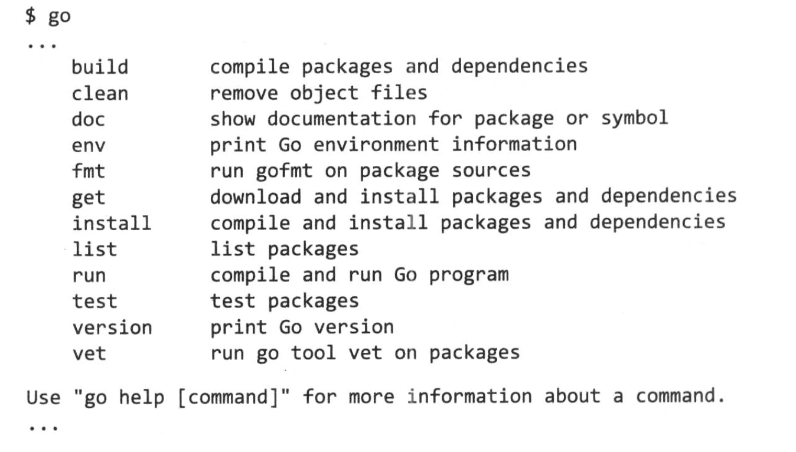
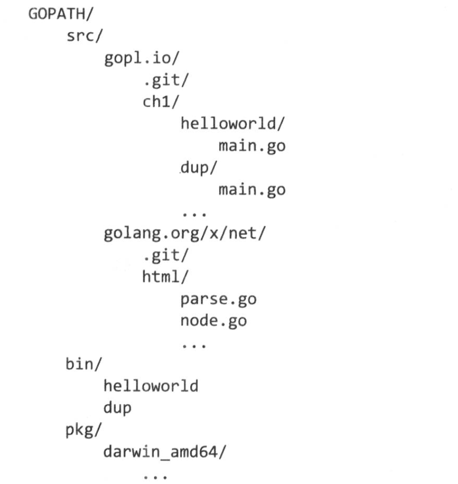

# 包管理

## 导入路径
每一个包都通过一个唯一的字符串进行标识，它称为导入路径，它们用在 import 声明中。
除了标准库中的包之外，其他包的导入路径应该以互联网域名作为路径开始。

```go
import (
    "fmt"
    "math/rand"
    "encoding/json"
    "golang.org/x/net/html"
    "github.com/go-sql-driver/mysql"
)
```


## 包的声明
在每一个 Go 源文件的开头都需要进行包声明。主要的目的是当该包被其他包引入的时候作为其默认的标识符（称为包名）。

通常，包名是导入路径的最后一段，因此即使导入路径不同的包，二者也可以拥有同样的名字。

```go
package main

import (
    "fmt"
    "math/rand"
)

func main() {
    fmt.Println(rand.Int())
}
```


## 导入声明
一个 Go 源文件可以在 package 声明的后面和第一个非导入声明语句前面紧接着包含零个和多个 import 声明。
每一个导入可以单独指定一条导入路径，也可以通过圆括号括起来的列表一次导入多个包。

```go
import "fmt"
import "os"

import (
    "fmt"
    "os"
)
```

导入的包可以通过空行进行分组；这类分组通常表示不同领域和方面的包。

```go
import (
    "fmt",
    "html/template"
    "os"

    "golang.org/x/net/html"
    "golang.org/x/net/ipv4"
)
```

如果需要把两个名字一样的包导入到第三个包中，导入声明就必须至少为其中的一个指定替代名字来避免冲突。这叫做重命名导入。

```go
import (
    "crypto/rand"
    mrand "math/rand"
)
```

> 每个导入声明从当前包向导入的包建立一个依赖。如果这些依赖形成一个循环，go build 工具会报错。


## 空导入
如果导入的包的名字没有在文件中引用，会产生一个编译错误。有时间，我们必须导入一个包，仅仅是为了利用其副作用。

为了防止“未使用的导入”错误，可以使用 `_` 表示导入的内容为空白标识符。通常情况下，空白标识不可能被引用。这称为空白导入。

```go
import _ "image/png" // 注册 PNG 解码器
```


## 包及其命名
- 尽量使用简短的名字，但是不要短到像加密了一样。
- 尽可能保持可读性和无歧义。例如，使用 imageutil 就比 util 更具体和清晰。
- 包名通常使用统一的形式。标准包 bytes、errors 和 strings 使用复数来避免覆盖响应的预声明类型，使用 go/types 来避免和关键字的冲突。
- 包成员的命名。例子：string 这个词不会出现在任何成员名字中，通过 strings.index 、strings.Replacer 等引用它们。


## go 工具
go 工具将不同种类的工具集合并为一个命令集。它是一个包管理器，它是一个构建系统，它还是一个测试驱动程序。



### 工作空间的组织
- **GOPATH**：指向工作空间的根，它是用户必须进行配置的环境变量。它有三个子目录：src 子目录包含源文件，每一个包放在一个目录中，src 下包含多个源代码版本控制仓库；pkg 子目录是构建工具存储编译后包的位置；bin 子目录放置的是可执行程序。
  


- **GOROOT**：指定 Go 发行版的根目录，其中提供所有标准库的包。用户无需设置 GOROOT，默认情况下 go 工具使用它的安装路径。

### 包的下载
`go get` 命令可以下载单一的包，也可以使用 `...` 符号来下载子树或仓库，该工具也计算并下载初始包所有的依赖性。下载完成后，它会构建它们，然后安装库和相应的命令。

`go get` 创建的目录是远程仓库的真实客户端，而不仅仅是文件的副本。

### 包的构建
`go build` 命令编译每一个命令行参数中的包。
`go run` 可以编译并马上运行指定的包。
`go install` 命名和 go build 很相似，区别是它会保存每一个包的编译代码和命令，编译后的包保存早 $GOPATH/pkg 中，可执行的命令保存在 $GOPATH/bin 目录中。

如果一个文件名包含操作系统或处理器体系结构名字（如 net_linux.go 或 asm_amd64.s），go 工具只会在构建指定规格的目标文件的时候才进行编译。例如：

```go
// +build linux darwin
```

注释在包的声明之前（它是文档注释），go build 只会在构建 Linux 或 Mac OS X 系统应用的时候才会对它编译，下面的注释指出任何时候都不要编译这个文件：

```go
// +build ignore
```

### 包的文档化
Go 文档注释总是完整的语句，使用声明的包名作为开头的第一句注释通常是总结。
`go doc` 工具输出命令行上指定的内容的声明和整个文档注释。

### 内部包
go build 工具会特殊对待导入路径中包含路径片段 internal 的情况。这些包叫做内部包。内部包只能被另一个包导入使用，这个包位于以 internal 目录的父目录为根目录的树中。例如，net/http/internal/chunked 可以从 net/http/httputil 或 net/http 导入，但是不能从 net/url 进行导入。

### 包的查询
`go list`  命令获取每一个包的完整元数据，并且提供各种对于用户或者其他工具可访问的格式。go list 命令的参数可以包含“...”通配符，它用来匹配包的导入路径中的任意字串。
